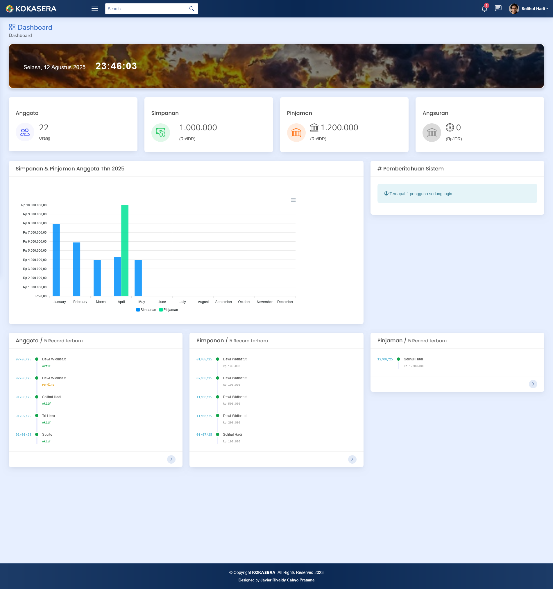

# Aplikasi (Lite)
Aplikasi Koperasi (Versi Lita) adalah aplikasi koperasi simpan pinjam yang dikembangkan berdasarkan versi 3.0.0 yang sebelumnya memiliki fitur pengelolaan transaksi lengkap. 
Aplikasi koperasi pada versi ini sengaja dikembangkan lebih sederhana dan hanya menyediakan fitur khusus untuk koperasi simpan pinjam saja. 
Hal tersebut bertujuan agar proses pengelolaan simpan pinjam dapat dilakukan lebih mudah dan efektif. 
Dengan fitur yang lebih ringkas, diharapkan mempermudah pengurus koperasi mengelola data menjadi lebih cepat dan akurat. 
Pada versi ini, entitas pengguna dirancang lebih interaktif dan terhubung dengan alur bisnis secara langsung seperti pengajuan anggota, pembayaran simpanan secara mandiri dan memungkinkan anggota koperasi mengajukan pinjaman.

## Gambaran Umum
Secara umum, aplikasi Koperasi (Versi Lita) ini memiliki 4 (empat) entitas akses dengan tugas dan hak yang berbeda-beda. 
Entitas akses tersebut terdiri dari anggota, sekretaris, bendahara dan ketua. Khusus untuk anggota, entitas tersebut memiliki kelompok data yang berbeda dengan entitas lainnya. 

## Fitur Aplikasi
1. Akses  
    Berfungsi mengelola data akses pengguna pada level pengurus.
2. Anggota
   - Anggota  
     Berfungsi untuk mengelola semua data anggota, input data anggota, ubah dan hapus. Terdapat filter untuk pencarian, import untuk memasukan data dari excel dan export ke data excel.
   - Keluar & Masuk   
     Menampilkan rekapitulasi data keluar-masuk anggota berdasarkan periode waktu tertentu.
   - Rekap Anggota   
     Menampilkan rekapitulasi jumlah anggota keluar dan masuk berdasarkan divisi/unit kerja (untuk koperasi karyawan)
3. Simpanan Anggota
   - Jenis Simpanan  
     Halaman yang berfungsi untuk mengelola jenis-jenis simpanan yang berlaku di koperasi. Misanya simpanan pokok, simpanan wajib, simpanan sukarela, simpanan hari raya dan lain-lain.
   - Simpanan Wajib  
     Setelah anda mengelola jenis-jenis simpanan, maka anda akan tahu pada beberapa jenis simpanan tersebut terdapat simpanan yang rutin dibayarkan anggota. Halaman ini berfungsi untuk mengelola data simpanan wajib dan menambahkan data secara simultan untuk seluruh anggota.
   - Log Simpanan 
     Halaman ini berfungsi untuk mengelola data simpanan anggota secara reguler (satu per satu) untuk semua jenis simpanan yang sudah anda atur sebelumnya.
   - Rekap Simpanan 
     Halaman ini berfungsi untuk mempermudah anda melakukan monitoring jumlah simpanan anggota. Sistem dapat menampilkan jumlah simpanan berdasarkan jenis-jenisnya pada masing-masing unit/divisi (untuk koperasi karyawan) dan juga berdasarkan list anggota.
4. Pinjaman Anggota
   - Jenis Pinjaman 
     Fitur jenis pinjaman berfungsi untuk menyimpan paket pinjaman yang disediakan koperasi dengan pengaturan persentase jasa dan pengaturan periode angsuran secara khusus. Dengan adanya jenis pinjaman akan mempermudah pengurus koperasi ketika dibuatkan sesi pinjaman, karena akan langsung menyesuaikan dengan pengaturan jenis pinjaman yang telah diibuat. Walaupun demikian, pengurus koperasi masih dapat melakukan perubahan pada sesi pinjaman secara spontan jika dibutuhkan.
   - Sesi Pinjaman 
     Setiap data pinjaman anggota, dicatat pada sesi pinjaman. Fitur ini berfungsi mencatat besaran nilai pinjaman anggota, tanggal jatuh tempo, angsuran yang harus di bayar, lama periode angsuran dan status pinjaman anggota (Lunas, Masih Berjalan).
   - Tagihan/Tunggakan 
     Untuk mengetahui siapa saja anggota koperasi yang menunggak atas pinjaman yang dilakukan, maka diperlukan halaman yang melakukan rekapitulasi data tunggakan ini. Indikator tunggakan ditunjukan apabila anggota bersangkutan belum membayar angsuran sesuai tanggal jatuh tempo. Pada modul ini juga anda bisa melakukan input angsuran secara multiple, jika pembayaran angsuran serentak.
   - Rekap Pinjaman 
     Halaman rekap pinjaman berfungsi untuk menampilkan data rekapitulasi pinjaman anggota berdasarkan periode waktu tertentu. Pada halaman inii terdapat 3 fitur data yang ditampilkan, yang diantaranya adalah : Rekap jumlah data pinjaman secara keseluruhan, rekap data pinjaman berdasarkan unit kerja/ divisi, rekap data pinjaman berdasarkan anggota.

9. Laporan
   - Simpan Pinjam
   - Buku Bessar
   - Neraca Saldo
   - Laba Rugi
   - Riwayat Transaksi
10. Pengaturan Aplikasi
   - Pengaturan Umum
   - Auto Jurnal
   - Email Gateway
11. Log Aktivitas
12. Konten Bantuan
13. Profil Pengguna

### Perangkat Lunak
- PHP 7.4 atau lebih baru
- MySQL 5.7 / MariaDB 10.3 atau lebih baru
- Web Server : Wampserver, Xampp
- Browser : Mozila firefox / Google Chrome
- OS : Win 10 64 Bit

### Perangkat Keras
- CPU : 1,5 GHz
- RAM : 2 GB
- Storage : SSD 256 GB
- Internet : 1 Mbps

### Tahapan Instalasi
- Instal webserver (Xampp, Wamp) terlebih dulu kemudian jalankan.
- Simpan folder aplikasi pada directory htdoc (untuk pengguna xampp) atau www (untuk pengguna wamp).
- Masuk ke database mnggunakan phpmyadmin dengan cara ketik localhost/phpmyadmin
- Buat database baru dengan nama apapun (Misalnya : koperasi_lite)
- Import database aplikasi (database standar aplikasi ini disimpan pada folder db).
- Atur variabel koneksi database aplikasi pada file _Config/Connection.php
- Ubah nama database sesuai nama database yang tadi di buat (Misalnya : koperasi_lite).
- Buka aplikasi dengan cara ketik localhost/{nama_folder_aplikasi}
- Lakukan login untuk pertama kali dengan memasukan email : dhiforester@gmail.com dan password : dhiforester
### Referensi Komponen
- Template : NiceAdmin (https://bootstrapmade.com/demo/NiceAdmin/)
- CSS Library : Bootstrap v5.3.3 (https://getbootstrap.com/)

